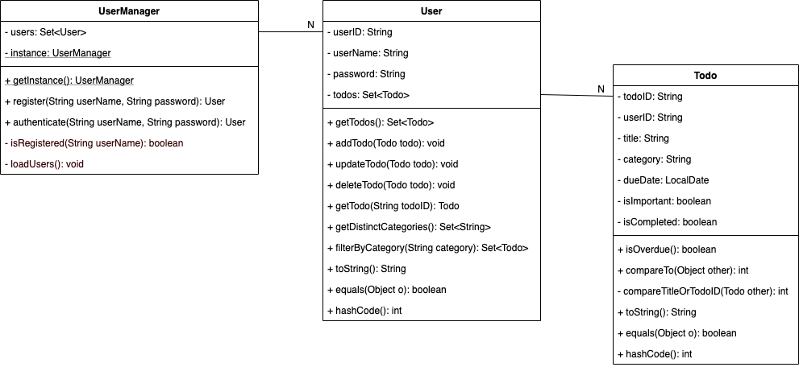
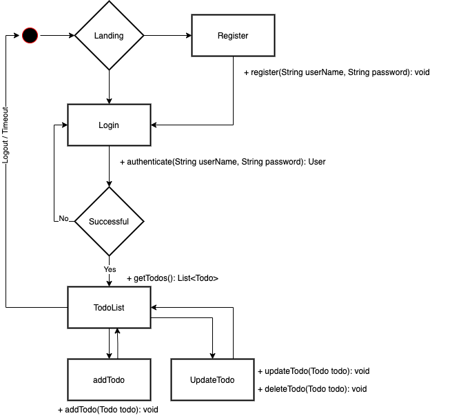

# Todo Application

* CAS: Software Development (SD-HS20)
* Kurs: Web Applikationen
* Gruppe 1:
    * Igor Stojanovic @stoji2
    * Sabina Löffel @loffs2
    * Christophe Leupi @leupc1
    * Raphael Gerber @gerbr19

***

## TODO: Allgemeine Beschreibung

Lorem ipsum dolor sit amet

## Design

 ### Domänenmodell

### Page Flow

### TODO: Klassendesign

## TODO: Implementierung

evtl. zusätzlich implementierte Features

## TODO: Inbetriebnahme

Anleitung zur Inbetriebnahme
