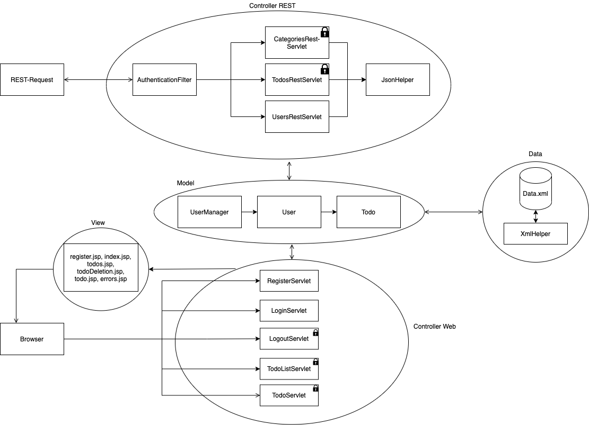

# Todo Application

* CAS: Software Development (SD-HS20)
* Kurs: Web Applikationen
* Gruppe 1:
    * Igor Stojanovic @stoji2
    * Sabina Löffel @loffs2
    * Christophe Leupi @leupc1
    * Raphael Gerber @gerbr19

***

## Allgemeine Beschreibung

Die Todo Applikation der Gruppe 1 bietet die Möglichkeit, Todo's pro User zu erstellen, bearbeiten und zu löschen. Die Todo's bestehen aus einem Titel (Pflichtfeld), einer optionalen Kategorie und einem "Due Date". Ebenfalls können Todo's als "important" oder "completed" markiert werden. Die Todo's können nach Kategorie gefiltert werden in der Übersicht.

Damit jeder User nur seine eigenen Todo's einsehen und bearbeiten kann, sind diese durch ein persönliches Userlogin geschützt.

## Design

### Domänenmodell

### Page Flow

### TODO: Klassendesign

#### MVC-Modell: 

## TODO: Implementierung

### Zusätzlich implementierte Features
Die Projektgruppe hat zusätzliche Features erfasst:
* Statistiken
* Zusätzliche Filtermethoden
* Löschung aller erledigten Todos
* Weiterleitung von (nicht) eingeloggten Benutzer
* Error-Page

#### Statistiken
Hat ein Benutzer mehr als ein Todo erfasst, wird unterhalb der Übersichtsliste eine Statistik angezeigt, 
die auf einen Blick zeigt, wie viele Todos vorhanden und wie viele davon offen, wichtig oder gar überfällig sind.

#### Zusätzliche Filtermethoden
Ein Benutzer hat die Möglichkeit, neben der Filterung nach Kategorien, auch nach dem Status (Incomplete, complete, overdue, important) der Todos zu filtern.
Eine Filterkombination aus Kategorie und Status ist auch möglich. 

#### Löschung aller erledigten Todos
Der Benutzer hat die Möglichkeit, mit nur einem Click alle erledigten Todos zu löschen.

#### Weiterleitung von (nicht) eingeloggten Benutzer
Eingeloggte user werden beim Versuch auf die Register- oder Loginseite zuzugreifen, direkt weitergeleitet, solange die Session noch aktiv ist.
Gleichzeitig können nicht eingeloggte Benutzer nicht auf den Userbereich zugreifen und werden an /login weitergeleitet.

#### Error seite
Für das Abfangen von möglichen Fehlern und beim Zugriff auf nicht vorhandenen Ressourcen (404) wurde eine Error-Page erstellt.

## TODO: Inbetriebnahme
Die Applikation lässt sich Lokal über einen Tomcat Server starten: http://localhost:8080/todoapp
Wenn noch kein Userlogin existiert, kann ein neuer User registriert werden über den Button "Register".
Nach der Registration kann sich der User einloggen und erhält eine leere Übersichtsliste ohne Todo's. Über den Button "+New Todo" kann ein neues Todo erfasst werden.
Nach der Eingabe der Pflichtfelder (Titel) kann das Todo mit dem Button Save abgespeichert werden, damit es in der Übersichtsliste erscheint.
Die Todos können über die Buttons unter der Spalte Action bearbeitet und gelöscht werden.

Über die Rest-Schnittstelle können die angeforderten Requests abgesetzt werden gegen die Applikation. Die Datenpersistenz wurde mit XML implementiert. Für die Rest-Schnittstelle wurde eine JSON Helper Klasse erstellt und für die Datenhaltung dient die XmlHelper Klasse.

### Konfiguration des Tomcat-Servers
Damit die Applikation wunschgemäss gestartet werden kann, müssen folgende Einstellungen im Tomcat vorgenommen werden:

